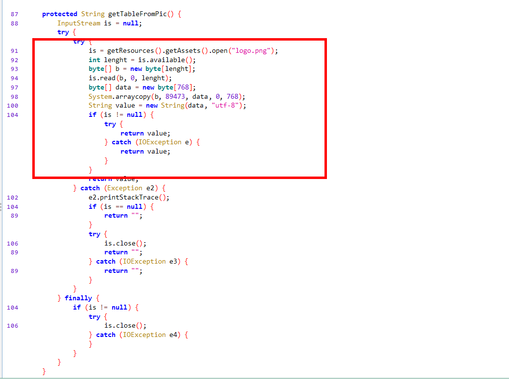

# AliCrackme_1的逆向思路与心得

## 正常操作流程

将app安装后运行，会出现一个界面，要求输入密码，如图：

  

随便输入密码“123456”后，点击登录按钮，提示密码错误：
  

那么，这个app的目标就是找出正确的密码了。

## 方案一 逆向算法

### 反编译

要逆向算法，第一步就是要获得app的源码，这里可以使用jadx尝试将app反编译。所幸这个app并没有什么加固和混淆，可以直接反编译出来 。如图：
  

### 定位程序主界面

通过反编译出来的AndroidManifest.xml文件，找到该app的主Activity。非常简单，通过找Main属性的标签非常容易定位到，如图：
  

### 分析源代码

#### 主验证逻辑代码

找到主activity的类名后，则根据该类名定位到对应的代码文件
  
点开后，可以看到程序的主要代码。由于该app是输入密码，再点击登录按钮后再执行验证逻辑的，在Android中，点击事件对应的就是onClick函数了，所以先查看该函数的逻辑。找出验证密码的逻辑在哪里。针对验证密码，逃不过读取输入->转换输入->验证 这三个步骤，所以优先确定这三个步骤的主要逻辑代码，然后再做进一步的分析。

+ 读取界面输入的密码。
  可以非常简单可以找到，32行就是读取用户输入密码的位置。值传给了password变量
+ 读取到输入的密码后，找出对应处理函数。
  通过函数MainActivity.this.bytesToAliSmsCode，将密码转换。
+ 找出处理后的密码，与正确密码校验的代码。
  在54行，通过equals函数，判断转换后的密码与pw变量的值是否一致。如果不一致，则执行57-64行弹窗代码。那么可以判断出，正确密码保存在pw变量中。

  

#### 正确密码的产生逻辑

在上一步中，可以确定，正确的密码是保存在pw变量中的，而pw变量的赋值是在34行，通过getPwdFromPic函数计算出来的，通过搜索函数名，可以快速定位到该函数的代码位置。
  
  


逻辑大概如下：
+ 从资源文件里，在Assets目录下，读取logo.png的字节数据，然后将这些数据转换成字节数组，赋给b变量。对应代码的119-125行。
+ 从b变量的字节数组中截取从91265开始的18个数组。将该这一片段的数据赋给data。对应的是代码的126行。
+ 将data的字节数组，按utf8的格式，转换成字符串，对应的是代码的128行。赋给value，然后返回value。

总的一句，就是从logo.png中读取18个字节，按utf8的编码格式转换成字符串，就是正确的密码了。

#### 输入密码的转换逻辑

在刚开始分析主验证逻辑的时候，已经定位到，用户的输入的密码是通过MainActivity.this.bytesToAliSmsCode函数转换的，现在来分析该函数的处理逻辑。在定位到该函数的代码后，发现只有短短的几行。如图：
  
该函数主要有两个输入参数，查看前面的调用代码
```java
enPassword = MainActivity.bytesToAliSmsCode(table, password.getBytes("utf-8"));
```
很明显第二个参数就是输入的密码了，只是做了变换处理，将输入的字符串按utf8的编码，转换为字节数组。
那么第一个参数是什么呢，查看table变量的赋值的地方，该变量是由getTableFromPic函数生成的
  
查看getTableFromPic函数的代码，如下：
  
逻辑与pw的转换基本一致，也是从资源文件里读取logo.png，截取一部分字节按utf8转换为字符返回。
回到输入密码的转换逻辑bytesToAliSmsCode函数中，主要是一个for循环，从data的字节数组中，读取每一个字节，以该字节为索引，读取table字符串的字符，再拼成一个字符串。
在校验逻辑中，将该转换后的字符串与正确的字符串做比较，这就是该app的全部逻辑。


### 算法还原

在知道大概逻辑后，则可以知道，完整逻辑如下：
+ 从logo.png中读取一部份数据，作为正确的密码
+ 从logo.png中读取一部份数据，作为加密的对照表
+ 将用户输入的密码，转换为索引，从上一步的对照表中，读取数据拼成字符串
+ 验证密码

根据上述逻辑，那么可以使用正确密码，找出该密码的每个字符在对照表中的索引，将每个索引转换成字符，就是正确密码了。
主要的代码如下有以下几个片段，其中大部分可以使用反编译后代码
+ 读取文件，截取片段作为正确密码
  ```java
      public String getPwdFromPic() {
        byte[] is = null;
        is = Utils.readFileInByte("logo.png");
        byte[] data = new byte[18];
        System.arraycopy(is, 91265, data, 0, 18);
        String value = new String(data, StandardCharsets.UTF_8);

        return value;
    }
  ```
+ 读取文件，截取片段作为对照表
  ```java
      public String getPwdFromPic() {
        byte[] is = null;
        is = Utils.readFileInByte("logo.png");
        byte[] data = new byte[18];
        System.arraycopy(is, 91265, data, 0, 18);
        String value = new String(data, StandardCharsets.UTF_8);

        return value;
    }
    ```
+ 根据正确密码查找对照表的位置
  ```java
  public static void main(String[] argc){

        AppCode appCode=new AppCode();
        String table=appCode.getTableFromPic();
        String pwd=appCode.getPwdFromPic();

        StringBuilder sb = new StringBuilder();
        StringBuilder sa = new StringBuilder();

        for (int i=0;i<pwd.length();i++){
            int index=table.indexOf(pwd.charAt(i));
            sa.append(index);
            sb.append((char)(index));
        }
        System.out.println("索引串："+sa.toString());
        System.out.println("索引转换后的字符串："+sb);


    }
  ```
### 执行验证

算法执行后，得出结果的581026：
  
在app上输入验证通过
  
